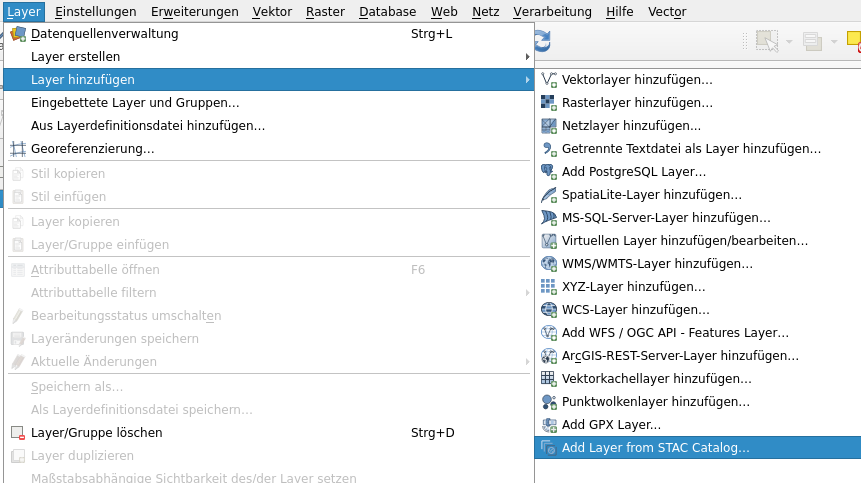
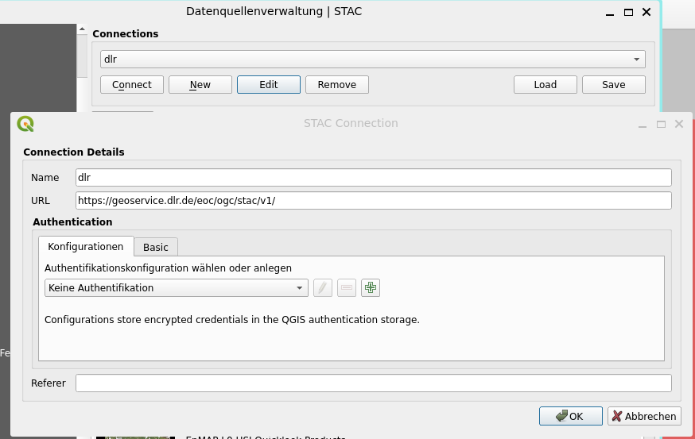
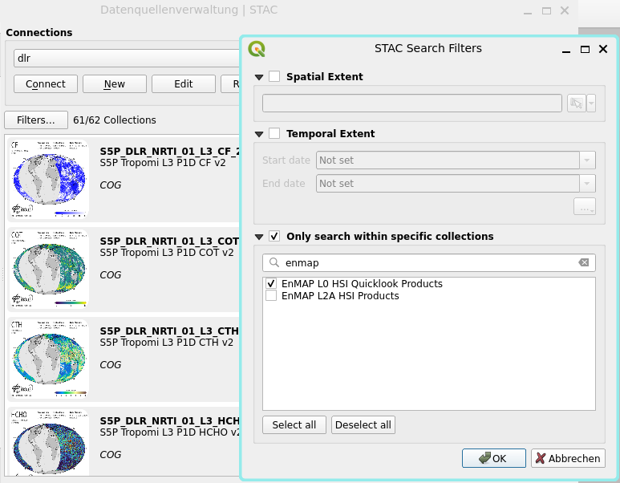
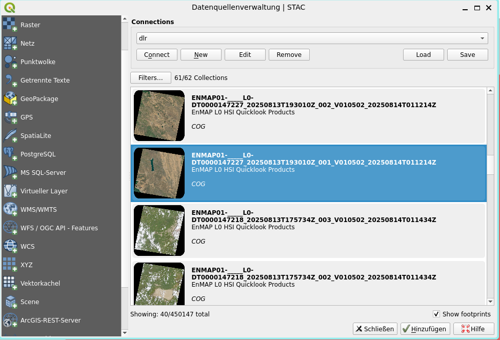
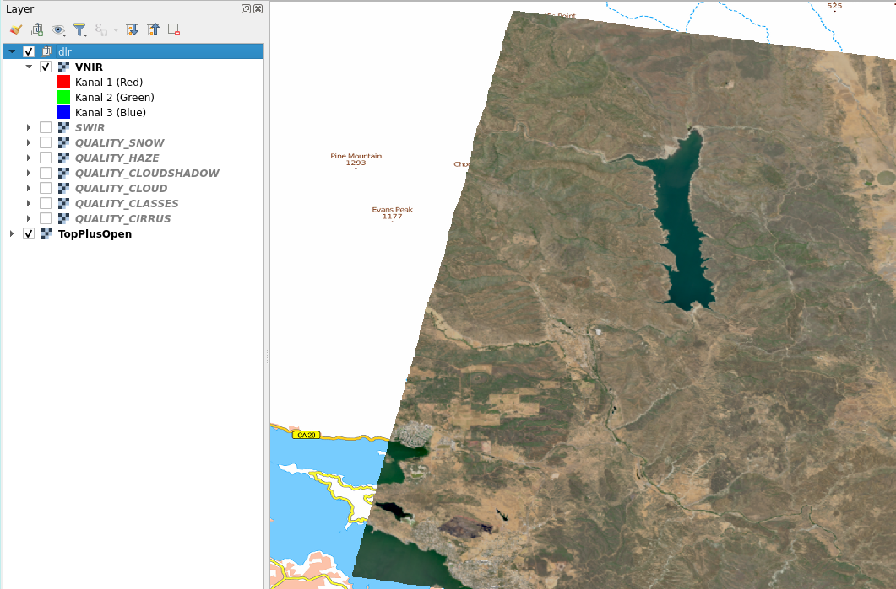
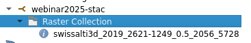

# STAC Hands-on

## Übung 1: STAC-API mit QGIS nutzen

1. Erstellen Sie ein neues QGIS Projekt
2. Öffnen Sie die STAC Datenquellenverwaltung über Layer -> Layer hinzufügen -> Add Layer from STAC Catalog...



3. Erstellen Sie eine neue Connection mit der URL `https://geoservice.dlr.de/eoc/ogc/stac/v1/`



4. Den Dialog mit "OK" schliessen und mit der erstellten Datenquelle  verbinden ("Connect")
5. Öffen Sie den Dialog "Filters..." und schränken die Ansicht auf den Katalog "EnMAP L0 HSI Quicklook Products" ein



6. Klicken Sie mit der rechten Maustaste auf eines der Items und fügen dem Projekt ein Satellitenbild über "Add Layer" -> "SWIR" hinzu


Ermitteln Sie die Datenquelle des hinzugefügten Layer mittels Mouseover auf dem Bildlayer im Layer-Menu.



## Übung 2: STAC-Katalog erstellen

Für die folgende Übung wird [stactools](https://stactools.readthedocs.io/) benötigt.

Installation mit dem Python Paketmanager [uv](https://docs.astral.sh/uv/):
```shell
uv tool install stactools[validate] --with requests
```

Alternativ kann auch pip verwendet werden:
```shell
pip install stactools
```

1. Erstellen Sie ein Verzeichnis `stac` und einen minimalen Katalog (`stac/catalog.json`) mit folgendem Inhalt:
```json
{
  "stac_version": "1.1.0",
  "type": "Catalog",
  "id": "mycatalog",
  "title": "Raster Catalog",
  "description": "Raster Catalog",
  "links": [
    {
      "rel": "child",
      "href": "./collection.json",
      "type": "application/json",
      "title": "Raster Collection"
    }
  ]
}
```

2. Erstellen Sie eine minimale Collection (`stac/collection.json`) mit folgendem Inhalt:
```json
{
    "stac_version": "1.1.0",
    "type": "Collection",
    "id": "mycollection",
    "description": "Raster Collection",
    "license": "other",
    "extent": {
        "spatial": {
            "bbox": [[-180, -90, 180, 90]]
        },
        "temporal": {
            "interval": [[null, null]]
        }
    },
    "links": [
      {
        "rel": "root",
        "href": "./catalog.json",
        "type": "application/json",
        "title": "Raster Catalog"
      }
    ]
}
```

3. Erstellen Sie ein Item mit Hilfe von stactools mit folgendem Befehl:
```shell
stac create-item https://data.geo.admin.ch/ch.swisstopo.swissalti3d/swissalti3d_2019_2621-1249/swissalti3d_2019_2621-1249_0.5_2056_5728.tif >stacitem.json
```
4. Fügen Sie das Item mit Hilfe von stactools zur Collection hinzu:
```shell
stac add --collection mycollection stacitem.json stac/catalog.json
```

5. Überprüfen Sie die generierte Katalog-Struktur:
```
stac describe stac/catalog.json

* <Catalog id=mycatalog>
    * <Collection id=mycollection>
      * <Item id=swissalti3d_2019_2621-1249_0.5_2056_5728>
```

* Untersuchen sie, welche Erweiterungen an `collection.json` vorgenommen wurden. Schauen Sie insbesondere `extent` und `links` an!

* Schauen Sie sich das hinzugefügte Item `swissalti3d_2019_2621-1249_0.5_2056_5728.json` an. Welche URL (`href`) und `roles` hat das enthaltene Asset?

6. Schliesslich können Sie den erstellten statischen Katalog als QGIS STAC-Connection mit der URL `file:///<verzeichnis>/stac/catalog.json` hinzufügen und den Inhalt im Browser anschauen


